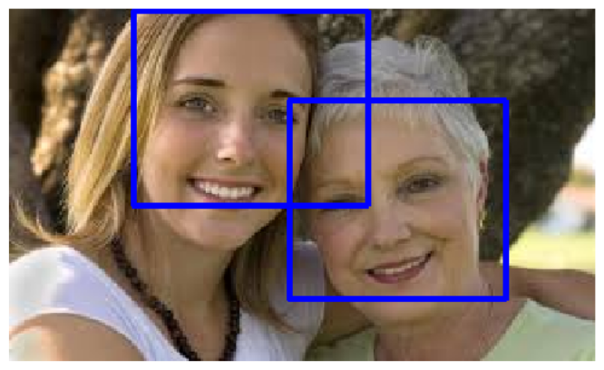

# computer_vision
 
>### Our project is based on training using CNN and deep nueral networks. In this project we have used MTCNN to create the model and then we used the training data to train the model.
>
>### Our Project is divided into the following parts:-
>1. Detecting faces in an image and printing the number of faces detected in the image
>2. Predicting the gender of the detected person as male or female based on the facial appearance.
 
## 1. Face Detection
 
>### Brief Introduction
Face detection is a computer vision problem that involves finding faces in photos.
 
It is a trivial problem for humans to solve and has been solved reasonably well by classical feature-based techniques, such as the cascade classifier. More recently deep learning methods have achieved state-of-the-art results on standard benchmark face detection datasets. One example is the **"Multi-task Cascade Convolutional Neural Network, or MTCNN** for short.Detecting faces in a photograph is easily solved by humans, although has historically been challenging for computers given the dynamic nature of faces. For example, faces must be detected regardless of orientation or angle they are facing, light levels, clothing, accessories, hair color, facial hair, makeup, age, and so on.Given a photograph, a face detection system will output zero or more bounding boxes that contain faces. Detected faces can then be provided as input to a subsequent system, such as a face recognition system.There are perhaps two main approaches to face recognition: feature-based methods that use hand-crafted filters to search for and detect faces, and image-based methods that learn holistically how to extract faces from the entire image.
 
Feature-based face detection algorithms are fast and effective and have been used successfully for decades.
 
>###  Implementations for face recognition:-
>- Cascasde Classifier
>- MTCNN
>
>As Cascade classifier's was less efficient, we had to shift to MTCNN for our final face detection model.
>
>Below is some brief description of both the models.
 
## a. Cascade Classifier (From Opencv)
 
One of the most successful face detection technique called cascade classifiers was first described by Paul Viola and Michael Jones and their 2001 paper titled “Rapid Object Detection using a Boosted Cascade of Simple Features.”In the paper, effective features are learned using the AdaBoost algorithm, although importantly, multiple models are organized into a hierarchy or “cascade”. In the paper, the AdaBoost model is used to learn a range of very simple or weak features in each face, that together provide a robust classifier.The models are then organized into a hierarchy of increasing complexity, called a “cascade“.Simpler classifiers operate on candidate face regions directly, acting like a coarse filter, whereas complex classifiers operate only on those candidate regions that show the most promise as faces.The result is a very fast and effective face detection algorithm that has been the basis for face detection in consumer products, such as cameras. It is a modestly complex classifier that has also been tweaked and refined over the last nearly 20 years.
 
A modern implementation of the Classifier Cascade face detection algorithm is provided in the OpenCV library. This is a C++ computer vision library that provides a python interface. The benefit of this implementation is that it provides pre-trained face detection models, and provides an interface to train a model on your own dataset.OpenCV provides the CascadeClassifier class that can be used to create a cascade classifier for face detection. The constructor can take a filename as an argument that specifies the XML file for a pre-trained model.
 
 
 
## b. MTCNN
A number of deep learning methods have been developed and demonstrated for face detection.
 
Perhaps one of the more popular approaches is called the “Multi-Task Cascaded Convolutional Neural Network,” or MTCNN for short, described by Kaipeng Zhang, et al. in the 2016 paper titled “Joint Face Detection and Alignment Using Multitask Cascaded Convolutional Networks.”The MTCNN is popular because it achieved then state-of-the-art results on a range of benchmark datasets, and because it is capable of also recognizing other facial features such as eyes and mouth, called landmark detection.
 
The network uses a cascade structure with three networks; first the image is rescaled to a range of different sizes (called an image pyramid), then the first model (Proposal Network or P-Net) proposes candidate facial regions, the second model (Refine Network or R-Net) filters the bounding boxes, and the third model (Output Network or O-Net) proposes facial landmarks.
 
The model is called a multi-task network because each of the three models in the cascade (P-Net, R-Net and O-Net) are trained on three tasks, e.g. make three types of predictions; they are: face classification, bounding box regression, and facial landmark localization.
 
The three models are not connected directly; instead, outputs of the previous stage are fed as input to the next stage. This allows additional processing to be performed between stages; for example, non-maximum suppression (NMS) is used to filter the candidate bounding boxes proposed by the first-stage P-Net prior to providing them to the second stage R-Net model.
 
The MTCNN architecture is reasonably complex to implement. Thankfully, there are open source implementations of the architecture that can be trained on new datasets, as well as pre-trained models that can be used directly for face detection.
 
 
 
## 2. Gender detection
For gender detection we have created a CNN and trained it using the data set provided in the link below.
 
This works on the technique of **'Gradient Descent'** and **'Back propagation'**.
 
**Gradient Descent** is an algorithm that minimizes the loss function by calculating it's gradient. By noting α∈R the learning rate, the update rule for gradient descent is expressed with the learning rate α and the cost function J as follows:
 
>W⟵W−α∇J(W)
 
But we need to find the partial derivative of Loss function wrt every parameter to know what is the slight change that we need to apply to our parameters. This becomes particularly hard if we have more than 1 layer in our algorithm. Here's where **Back Propagation** comes in. It's a way to find gradients wrt every parameter using the chain rule. Backpropagation is a method to update the weights in the neural network by taking into account the actual output and the desired output. The derivative with respect to weight ww is computed using chain rule and finally the weight are updated appropriately.
 
This is performed using tensorflow.
 
### **Tensorflow**
TensorFlow is an end-to-end open source platform for machine learning. It has a comprehensive, flexible ecosystem of tools, libraries and community resources that lets researchers push the state-of-the-art in ML and developers easily build and deploy ML powered applications.
 
>### Training Dataset: 
> https://www.kaggle.com/cashutosh/gender-classification-dataset
 
Example-

 
## Acknowledgement
We would like to express my gratitude towards team STAMATICS and their selectors who selected us for this project and gave us the golden opportunity of diving deep into the world of CV.
 
We would like to thank our mentors, Shivanshu and Akshay, who planned the project in a manner a begginer could relate to, and taught us very exciting things from history of CV, how CV evolved and slowly took us to the modern approach of CV.  We thank them for guiding us at all steps whenever we got stuck.
 
Regards, 
- Sahil Bansal 
200836, email - sahilb20@iitk.ac.in
- Shivam Singhal 
200939, email - singhals20@iitk.ac.in
- Utkarsh Srivsastava 
201070, email - utkarshs20@iitk.ac.in

